# Linux Command Line

## Basic Commands

- ```date```: current date
- ```cal```: current months calendar
- ```cal 1999```: calendar for 1999
- ```cal -3```: calendar (last month, current and next month)
- ```cal -y```: all year calendar
- ```clear```: clear console text
- ```exit```: exits de terminal

## Navigate Directories

### Linux File System Tree:


- **bin**: binary (commands and utilities that all users can run)
- **sbin**: this directory contains programs that performs vital system tasks (network management, disk partitioning). Only the superuser has access to these programs.
- **home**: each user is given a directory under the home directory. A user can store anything in his home directory
- **opt**: optional (additional software)
- **tmp**: temporary files, files created by various programs (**Generally cleared on reboot**)
- **var**: variable data, data that frequently changes over time.
  - Log files
  - Data bases
  - User mail
  - Spools -> temporary storage location
    - /var/spool is traditionally used for machine-local data being spooled to or from UNIX subsystems. For example, print jobs are spooled here for delivery to the lineprinter daemon, out-bound mail is spooled for delivery to remote systems, and UUCP files are spooled for transmission to UUCP neighbors. In-bound mail and news are spooled here for delivery to users, and at and cron jobs are spooled for delayed execution by the cron daemon.


### Commands

- ```pwd```: print working directory

- ```ls```: list directory

- ```cd```: change directory

- ```cd /```: take you to the root directory

- ```cd ~```: take you to the user home directory

- ```cd ./another_folder```: navigate from current directory to another_folder

- ```cd ..```: navigate from current directory to parent directory

- ```cd -```: go back to the previous working directory
  - ```cd /```: going to the root directory
  - ```cd ~/```: going to the home directory
  - ```cd -```: going back to the root directory


- ```cd "my work"``` or ```cd 'my work'``` or ```cd my\ work```: going to a folder with space

- ```ls /```: display your root directory

- ```ls ~```: display your home directory

- ```ls ..```: display the content of my parent directory

- **[DOES NOT WORK]** ```ls -```: should display you the content of your previous working directory


## Linux Links

- Every file in the system has an inode (Index node)
  - Contains all file information except the file content and name  
  - A database of a file
  - They contain:
    - Inode number
    - File size
    - Owner information
    - Permission
    - File type
    - Number of links
      - Soft Link
      - Hard Link
    - etc...

### Soft Link
- A soft link is the same as a shortcut in Windows
- Aka Symbolic link
- It is a pointer to the original file
- It is a file pointing to another file
  - Different inode number
- Small file size
- In case the original file gets deleted, the soft link will no longer work
- You can create soft links for directories


### Hard Link
- Different name of the same file
- Same file size
- Same inode number
- You cannot differentiate between a real file and a hard link
- They are kind of a copy of the file
- If I change a hard link file content, it will reflect on the other files (the original and other hard links)
- In case I delete the original file, the hard link file will still work
- **Be careful**: You should not create hard links for directories. Normally they are not even allowed because they break the file system structure.


### Commands

- ```ls -i```: show inode id of files

- ```ls -l```: show files information (size in bytes, permission, etc.)
  * Folders should start with the letter `d` 
  * 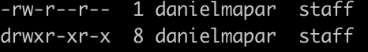

- ```ln```: link

- ```ln file_name hard_link1```: Create a hard link for a file (same inode)

- ```ln -s file_name soft_link1```: Create a soft link for a file

- ```ln -s .. c```: Create a soft link C for the parent directory you are currently located in

## LS Options

- ```ls```: List files by alphabetic order

- ```ls -i```: This will list the index node number of each file

- ```ls -a```: This will show all the files (-a == all files) in your current directory, including hidden files

- ```ls -l```: Long listing of all files in the directory and some important information.

- ```ls -t```: Sort files by modification date

- ```ls -r```: List the files in reverse fashion (in this case reverse based on alphabetic order)

- ```ls -rt OR ls -r -t```: List the file in reverse fashion (in this case reverse based on modification date)

- ```ls -li```: Long listing + show inode ids

- ```ls -lia```: Long listing + show inode ids + hidden files

- ```ls -R```: Show current directory content plus any children/sub directory content as well

- ```ls -Ra```: Show current directory content plus any children/sub directory content as well + including hidden files


## Touch Command (Create a file)

- Touch is used to create empty files

  - ```touch file_name```: Create a file called file_name
  - ```touch file_name1 file_name2 file_name3```: Creates 3 files
  - ```touch 'my file'``` or ```touch "my file"``` or ```touch my\ \ file```: create a file with a name containing spaces
    - ```\``` is a scape sequence


- Touch is also used to update a current files timestamp (modification dade)

  - ```touch newFile```
  - ```echo "test" > newFile```
  - ```touch newFile```: this will update the file timestamp and keep the content


## MKDIR (Make directory) and RMDIR (Remove directory) Commands

- If you want to create a directory, then you use ```mkdir``` command as follow:

  ```
  mkdir directory_name
  mkdir directory_name1 directory_name2 directory_name3
  ```

- To remove **empty** directories you can use ```rmdir``` command as follows:

  ```
  mkdir empty_dir
  rmdir empty_dir
  ```

  - In case you do ```rmdir``` in one directory that has files and another that is empty, it will only delete the empty one.


- To create a directory with a name containing spaces, you can do ```mkdir 'my directory'``` or ```mkdir "my directory"```

## RM (Remove) Command

  - To delete non-empty-directory files, or just normal files you just do:
    ```
    touch fileToDelete
    rm fileToDelete
    mkdir folder
    cd folder
    touch file
    cd ..
    ```
    - ```rm -R folder``` or ```rm -r folder```

    - In case of non-empty-directory you need to run ```rm``` with the recursive flag ```-R```. Otherwise it will fail
    - Also, the ```-R``` flag can be lowercase since it is not case sensitive for ```rm``` (although it is case sensitive for ```ls```)


  - ```rm``` options:

    - ```rm -i```: Prompt you before removing any existing file. the ```-i``` means interactive mode

    - ```rm -f```: Never prompt you before removing a file. And will not display a warning if the file you are trying to delete does not exist, meaning that it will ignore non existent files. -f means force

    - ```rm -v```: Verbose mode. It will print the name of each file before removing it.

    - ```rm -R``` or ```rm -r```: Recursively delete files. If the file is a directory, remove the entire directory and all its contents, including subdirectories.

## CP (Copy) Command

- The ```cp``` command copies files or directories. It can be used in two different ways:
  - Copy a file: ```cp file file2```
  - Make a copy of a directory: ```cp -R dir dir2```: ```dir2``` does not need to exist
    - This will make a copy of dir1 named dir2 (Assuming that dir2 didn't exist)

  -  In case you copy many files using the following syntax:
    - ```cp file1 file2 file3 dir```: ```dir``` must exist in this case.
    - Same case for directories: ```cp -R dir1 dir2 dir3```


- ```cp``` options:

  - ```cp -i```: Before overwriting an existing file, prompt the user for confirmation. **cp will silently overwrite files by default.**
  - ```cp -v```: Verbose mode (print the name of each file that was copied).
  - ```cp -R```: Recursively copy directories and their content. Just like the ```rm``` command, this option must be specified when copying a directory.
  - ```cp -r```: Same as cp -R


## MV (Move) Command

- The ```mv``` command can be used in two different ways.
  - Renaming files

    - ```mv file1 file2```: This will rename file1 to file2
    - ```mv dir1 dir2```: If your file is a directory, this will rename the directory
    - **You do not need to use the -R option with ```mv```**

  - Moving files

    - ```mv file1 file2 dir1```: This will move file1 and file2 to dir1. However, dir1 must exist
    - ```mv dir1 dir2 dir3```: This will move dir1 and dir2 to dir3. Again, dir3 must exist


- ```mv``` options:

  - ```mv -i```: Before overwriting an existing file, prompt the user for confirmation. If the option is not specified ```mv``` **will silently overwrite the file**

  - ```mv -v```: Verbose mode (print the name of each file that was moved or renamed)

## FILE (File) Command

  - Filenames are case sensitive in just like the commands are.

  - Linux has no concept of  `file extension` like Windows. You can have files without any extension.
    - It checks the file content to identify what kind is it.


  - The command ```file filename``` will give us information about the file type.

  - ```file LS -L OUTPUT.png```: LS -L OUTPUT.png: PNG image data, 1968 x 488, 8-bit/color RGBA, non-interlaced

## Command Line History

  - ```history```: Show all the commands executed in the cmd
  - ```history 10```: Show last 10 commands
  - ```history -c```: Clear history
    - Your history is stored at ```~/.bash_history```
  - ```!number```: Runs a command from history

## Shortcuts

  - ```Control+a```: Start of the line
  - ```Control+e```: End of the line
  - ```Control+d```: Remove character from left to right
  - ```Control+l```: Clear

## View text files (less, cat, tac, head, tail) Commands

  - ```less file1```: View the content of the file ```file1```
    - Press ```q``` to quit

  - ```cat file1 file2```: View the content of the file ```file1```concatenated with ```file2```
    - ```cat``` lets you see two files output concatenated

  - ```tac file```: Shows the content of file, but reversed
  - ```head -n 20 file```: Show first 20 lines of file
  - ```tail -n 20 file```: Show last 20 lines of file


## WC (word count) Command

  - ```wc file```: Presents the data like -> Number of lines, number of words, number of bytes
  - ```wc -l```: Show just number of lines
  - ```wc -w```: Show just number of words
  - ```wc -c```: Show just number of bytes
  - ```wc -L```: Length of longest line in characters

## Types of Commands

  - ```bash```: Born again shell

  - Executable programs
    - They are inside ```/bin``` and ```usr/bin```.
    - Example: ```cp``` command

  - Shell builtin
    - ```cd``` command
    - In computing, a shell builtin is a command or a function, called from a shell, that is executed directly in the shell itself, instead of an external executable program which the shell would load and execute.

      Shell builtins work significantly faster than external programs, because there is no program loading overhead. However, their code is inherently present in the shell, and thus modifying or updating them requires modifications to the shell. Therefore, shell builtins are usually used for simple, almost trivial, functions, such as text output.

  - Shell scripts
    - Custom programs written in shell script

  - Alias
    - ```ls``` command
    - Create your own commands
    - 	The alias command makes it possible to launch any command or group of commands (inclusive of any options, arguments and redirection) by entering a pre-set string (i.e., sequence of characters).

  - Display information about command type:
    - It displays if command is an alias, shell function, shell builtin, disk file, or shell reserved word.
    - ```type ls```: ls is hashed (/bin/ls)
    - ```type cd```: cd is a shell builtin
    - ```type cp```: cp is /bin/cp
      - ```file /bin/cp```: tells you that ```cp``` is an executable


  - ```which``` will display the path of shell scripts and executables, it does not support shell builtins.
    - ```which cp```: display executable location ```/bin/cp```


  - For shell builtin help you can do ```help cd```

  - For executable help you can do ```man cp```
    - Also for executables, you can do ```whatis cp``` to get a short description about the program


## Execute multiple commands

  - ```date; cal```: Separate commands using a semicolon
  - ```mkdir test && cd test1 && cd test```: Different from ```;``` the operand ```&&``` stops the execution if one of the commands fail (short circuit evaluation)


## Wild cards

  - ```*```: all occurrences
    - ```cp *.txt dir```
    - ```cp * dir```
  
  - `*.png` returns all the files that end with the extension .png

  - `pea?.png` returns all files that start with "pea", is followed by any single character, and end with .png (for example, peas.png and pear.png)

  - `*.{txt,pdf}` returns all files that end with either .txt or .pdf

  - `log[12345].pdf` returns files log1.pdf, log2.pdf, log3.pdf, log4.pdf and log5.pdf

  - ```?```: represents a single character
   - ```cp file?.txt dir```: copy all files file0.txt, file1.txt, etc. Any file that has a name structure like ```file``` + an unknown character + ```.txt```

  - ```[]```: range of characters
    - ```cp [abc]*.txt dir```: Copy all the file that begins with the letters abc to ```dir```

    - ```cp [!abc]*.txt dir```: Copy all the file that **does not** begins with the letters abc to ```dir```

        - Exclamation mark negates the command

    - ```cp [0-9]*.txt dir```: Copy all files starting from 0 to 9

    - ```cp [[:upper:]]* dir```: Copy all the files that starts with an upper case letter

    - ```cp [[:lower:]]* dir```: Copy all the files that starts with an lower case letter

    - ```cp *[[:digit:]] dir```: Copy all the files that ends with a digit

    - ```cp [[:alpha:]] dir```: Copy all the files that starts with a character from the alphabet

    - ```cp [[:alnum:]] dir```: Copy all the files that starts with a character from the alphabet or a number. (alpha numeric)

    - ```cp [[:alnum:]][0-9]* dir```: Copy all the files that starts with a character or a number (alpha numeric) and the second character must be a number from 0 to 9

    - ```cat ???```: View all files with exactly 3 characters

    - ```rm [[:digit]]*[abc]```: Remove all the files that begins with a number and ends with the letter (a,b or c)

    - ```rm [[:digit]]*abc```: Remove all the files that begins with a number and ends with the letters abc all together  

## Alias

  - ```alias myname="cd Desktop;mkdir dir"```: Create an alias called myname that goes to the Desktop folder and creates a directory called dir

  - ```unalias myname```: Delete an alias

  - To retain an alias, save it inside ```~/.bashrc```

  - ```alias```: List of all alias in the system

## Streams and Pipes

### Stream 

* `>` operator 
  * e.g. `grep "text" . > output.txt`
  * Writing to a file (overwrite)
  * e.g `head -n1 < /etc/passwd`
    * Using operator as input to an app

* `>>` operator 
  * e.g. `grep "text" . >> output.txt`
  * Append to a file 

### Pipes

* `ls | cowsay`
  * pipe the results from `ls` to the program `cowsay`

* `ls -l *.conf | wc -l | cowsay`

## Manage processes 

- `ps aux`
  * `a` = `--all` Display information about other users' processes as well as your own.
  * `u` = Display the processes belonging to the specified usernames.
  * `x` = When displaying processes matched by other options, include processes which do not have a controlling terminal.

- `top`

- `htop`

## Users, Groups and Permissions

* `adduser danielmapar`
  * Only root may add a user or group to the system.
  * `sudo`: `super user do`
    * `sudo -i`: login as `root`

* `sudo adduser danielmapar`
  * Executing command with root credentials 

* `sudo login danielmapar`
  * `cat /etc/passwd | grep "^danielmapar"`

* 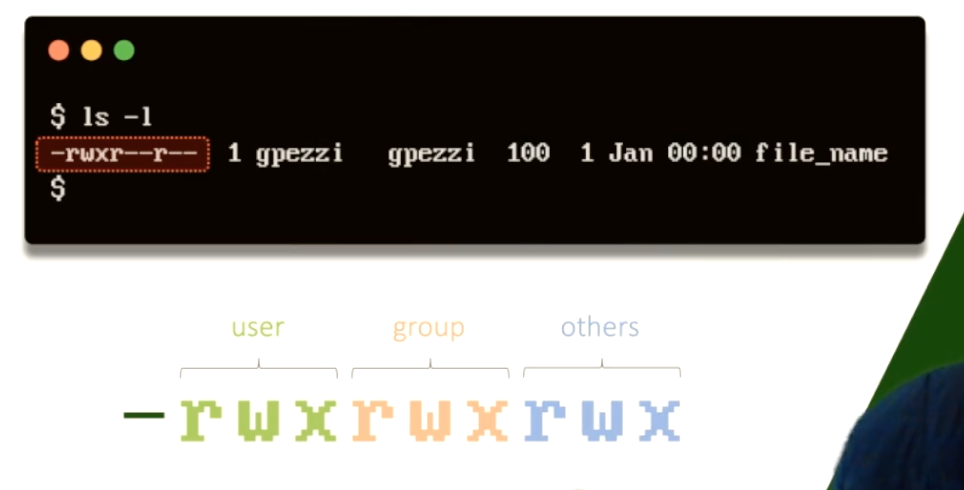
  * user = file owner
  * group = the group of the file owner
  * others = other users / groups
  * The first char can be `-` (for file), `d` for directory of `l` for link.

* `chmod +x file`
  * You can change the `user` and `group` permission to include `x` (execute).

* `chmod 755 file`
  * each number represents a sequence of 3 bits. In the case of 7 it represents 111 (read, write and execute). Another example is 5 (read, dont write, execute).
    * In this case, 7 changes the `user` permissions (`rwx`), the second and third numbers (5's) will change the `group` and `other` permissions respectively.

  * Anothe way to achieve this (`755`) is by running: `chmod u=rwx,g=rw,o=rw file`

## Environment Variables and RC Files

* `echo $USER`
* `echo $HOME`
* `echo $0`
  * my shell name
* `echo $PATH`
  * Path to find binaries
  * `PATH=$PATH:newfolder`
* `env`: list of env vars

* `RC` stands for run commands.
  * `.bashrc` = Bash Run Commands.

* `export $PATH=$PATH:/newpath`
  * the keyword `export` guarantees that if our current process spins child processes, it will also export this `env` var to the children processes.

## Shell Scripting 

* 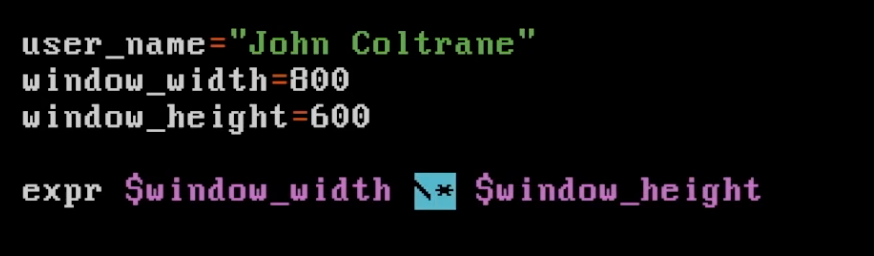
  * Variables in `sh` are always strings. We use `expr` to evaluate numerical expressions.
  * We escape `*` so it does not get confused by shell with a wildcard.
    * `$((1 + 1))` also works for `bash` only

* `$#` represents the number of parameters being supplied to the script.

* \` backticks are used to execute an expression.
  * 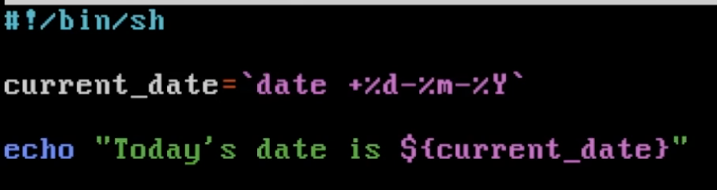 

* 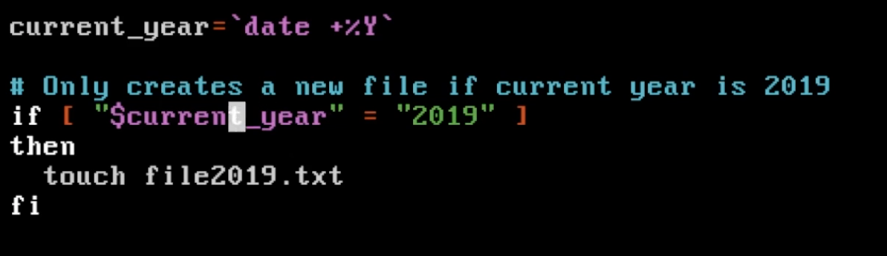
  * Space inside the brackets are mandatory.
* 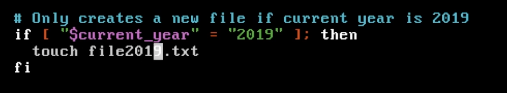

* 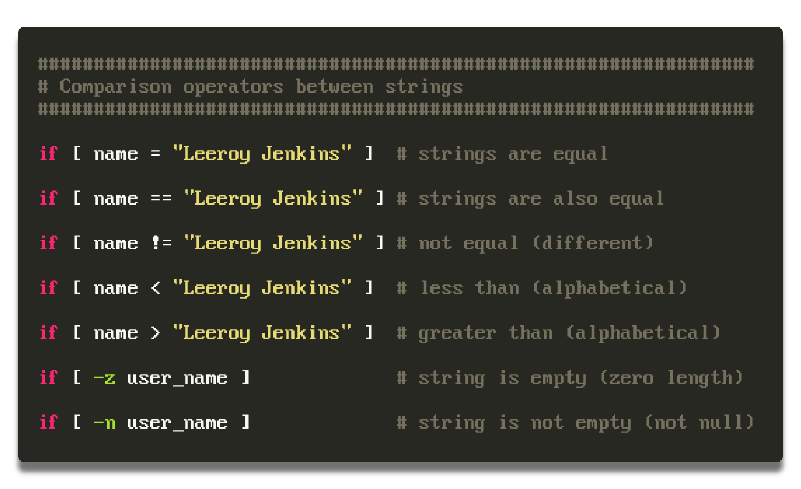
  * `==` is specific to `bash` (not present in sh (Bourne shell), ...). Using `POSIX` `=` is preferred for compatibility. In bash the two are equivalent, and in sh = is the only one that will work.

* 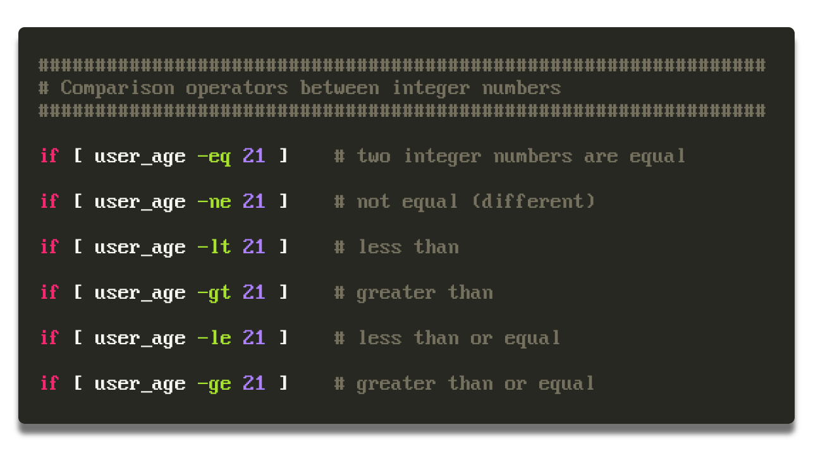

* 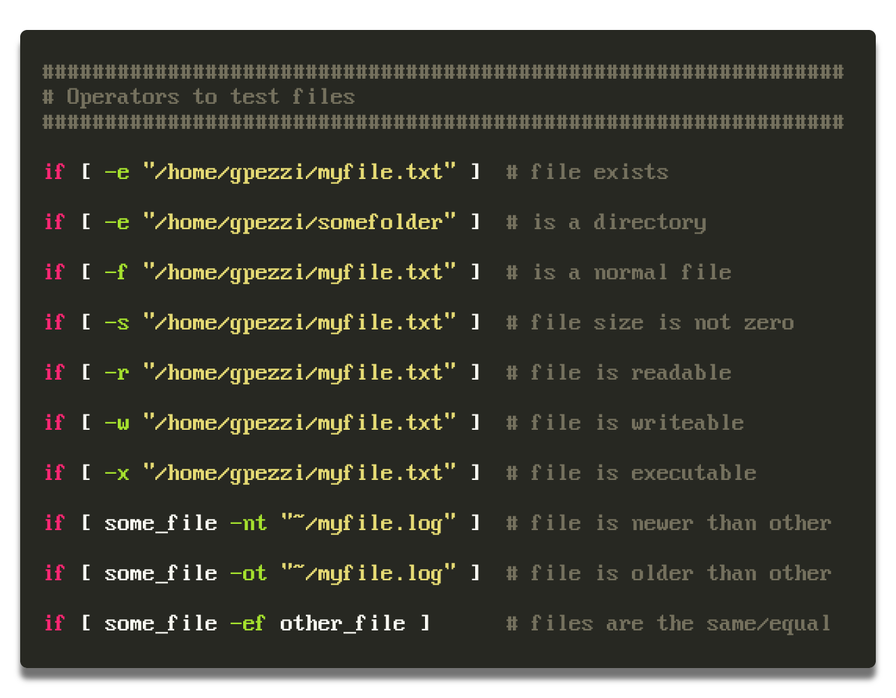

* 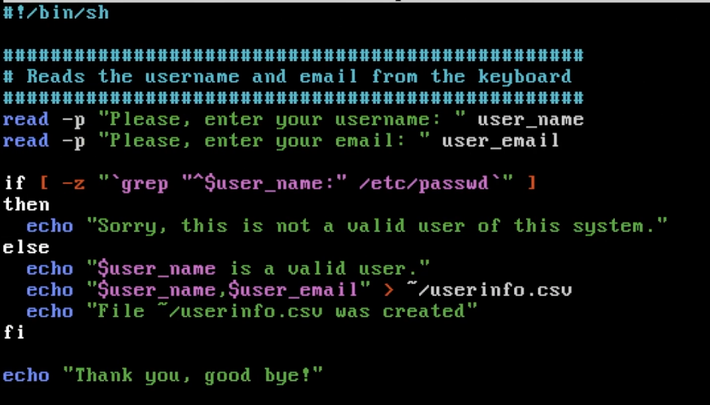
  * `^` means it should start with string.

* 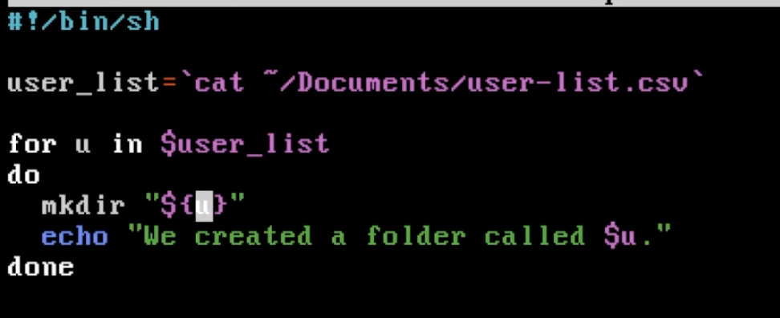

* 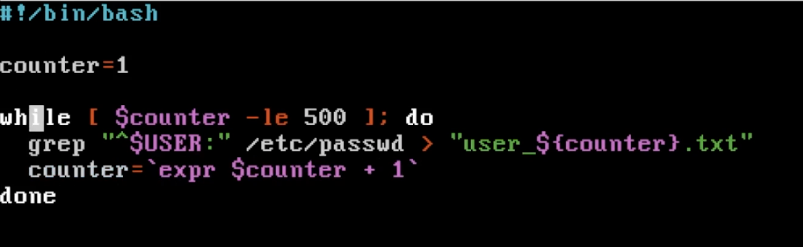

* You can detache a process from the terminal by adding `&` at the end.
  * `./my-script.sh &`

### Scheduling Tasks

* `crontab -l`
  * To print the file content

* `crontab -e`
  * To edit the file

* 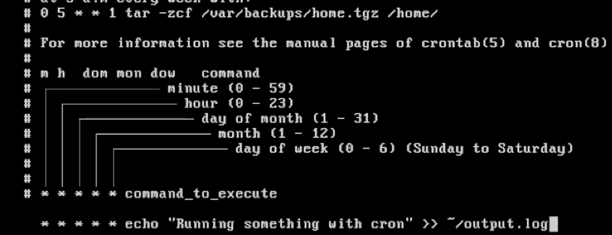
  * A deamon reads the cron table and runs it.
  * The name `cron` simply originates from Chronos, the personification of time in Greek mythology.

* 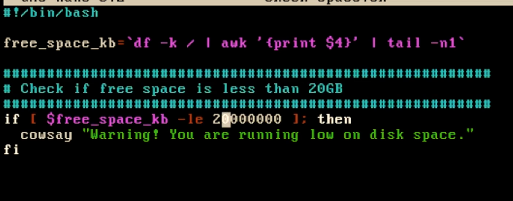

* 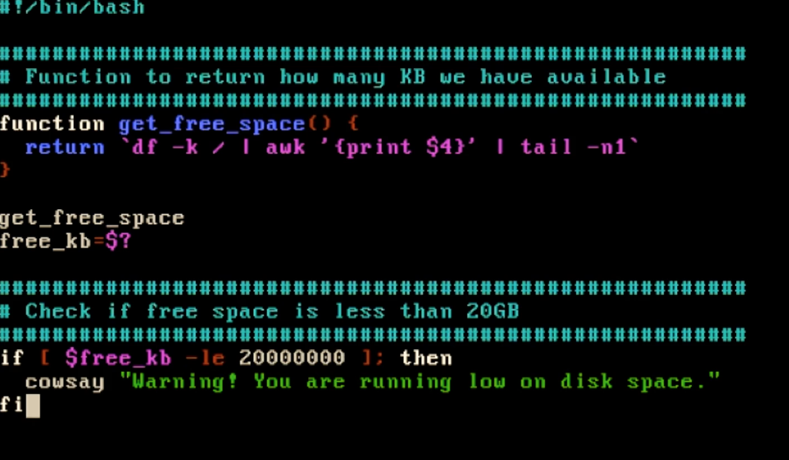